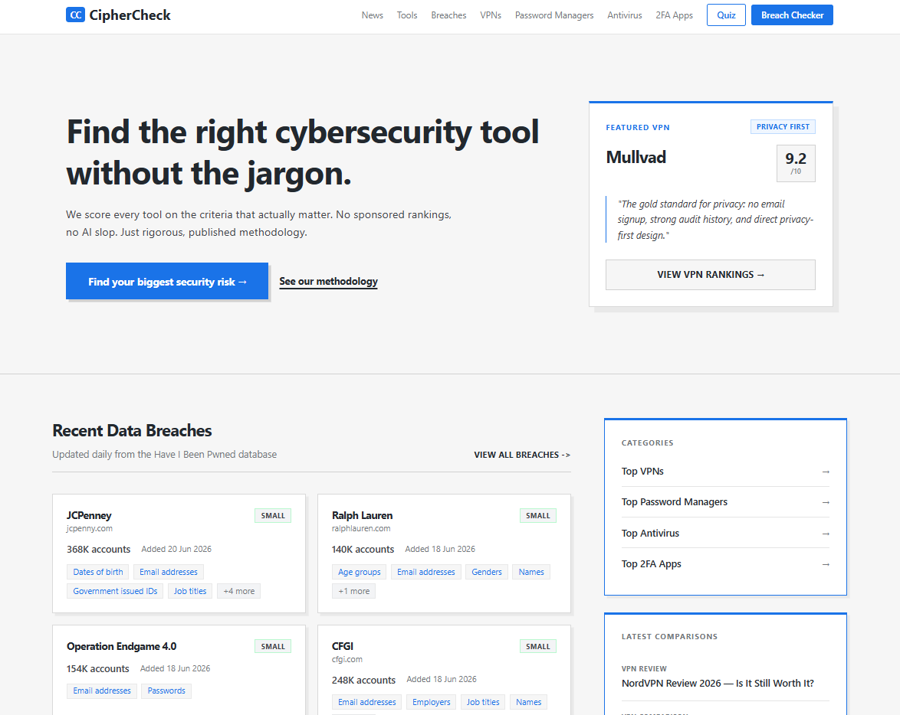
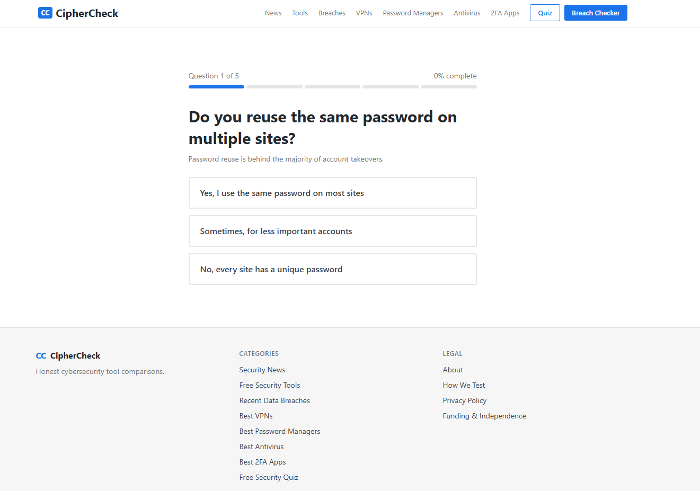
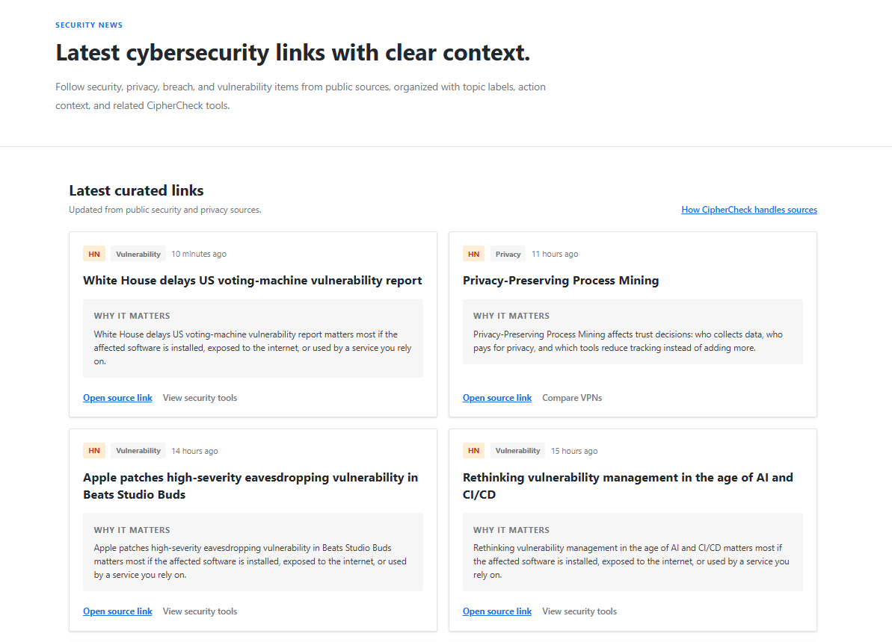
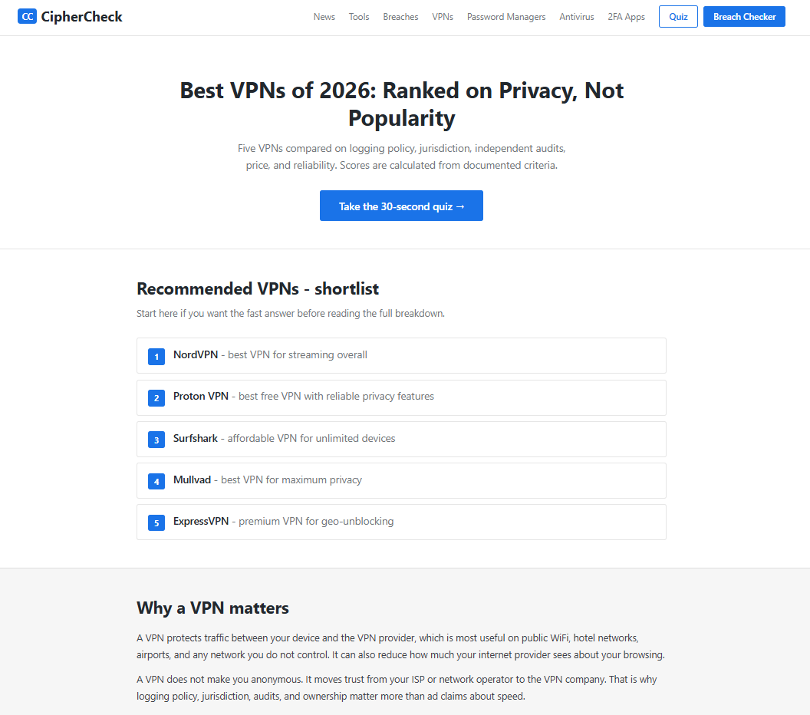

# CipherCheck

Cybersecurity tool comparison site that ranks products by published scoring criteria, not commission size.

CipherCheck is a cybersecurity product comparison site built for affiliate growth. It ranks VPNs, password managers, antivirus tools, and 2FA apps using published scoring criteria instead of commission size. It includes an AI recommendation quiz, HIBP k-anonymity breach checker, DNS leak test, local password strength checker, live security news, and PostHog funnel analytics from quiz start to affiliate click.

## Live Demo

[https://cipher-check-tau.vercel.app](https://cipher-check-tau.vercel.app)






## Status

Deployed at https://cipher-check-tau.vercel.app. Verified in Google Search Console — sitemap submitted, indexing in progress.

PostHog funnel is live and tracking from homepage through quiz to category pages. Affiliate architecture is ready to activate once a custom domain is in place — programme approvals require a real domain, not a .vercel.app subdomain.

## The Problem

Most cybersecurity affiliate sites rank NordVPN first because NordVPN pays the highest commissions. Users have no way to tell. CipherCheck publishes its full scoring methodology — criteria, weights, and sources — so rankings can be verified independently of which products have affiliate programmes.

## Tech Stack

| Layer      | Technology                                               |
| ---------- | -------------------------------------------------------- |
| Frontend   | Next.js 16, TypeScript (strict), Tailwind CSS v4         |
| AI         | Groq (llama-3.3-70b) — security quiz and recommendations |
| Analytics  | PostHog (funnels, session recording) + Vercel Analytics  |
| APIs       | HIBP (breach checker, k-anonymity), Hacker News, Reddit  |
| CI/CD      | GitHub Actions — lint, typecheck, build on every push    |
| Deployment | Vercel                                                   |

## Features

- **AI security quiz** — five questions, routes users to the most relevant category based on threat profile. AI is used only where personalisation helps: mapping a user's threat profile to the most relevant category and recommendation path. Core scoring remains deterministic and auditable.
- **Breach checker** — HIBP k-anonymity; only the first 5 chars of the SHA-1 hash leave the browser, password never sent in plaintext
- **DNS leak test** — verifies VPN is actually routing traffic
- **Password strength checker** — scored locally, nothing sent anywhere
- **Live security news** — Hacker News + r/netsec + r/privacy, ISR revalidates every 2 hours
- **Recent breaches tracker** — HIBP public API, ISR revalidates every 24 hours
- **Transparent scoring** — weighted criteria published at `/how-we-test`, scores computed from JSON data
- **Sitemap + robots.txt** — generated post-build via next-sitemap

## Affiliate Architecture

All affiliate links are centralised in `src/lib/affiliate.ts`. One file edit activates real tracking links across the entire site. Affiliate programme approvals (NordVPN Partners, Proton, Bitwarden) require a custom domain — pending until post-launch. Scoring and rankings are determined before affiliate links are assigned, not after.

## Architecture Decisions

- **Static JSON over a database** — ISR delivers sub-100ms loads for category pages. Product data changes quarterly at most. Migration path to Supabase is straightforward when traffic justifies it.
- **Groq over OpenAI** — free tier is sufficient for the quiz use case. Zero AI inference cost at MVP stage.
- **PostHog over Vercel Analytics alone** — Vercel Analytics has no funnel support. PostHog tracks the full acquisition path: homepage → quiz → category page → affiliate click, with session recordings to identify drop-off.
- **k-anonymity for the breach checker** — sending passwords to an API on a privacy-focused site would directly contradict the product's premise.
- **ISR revalidation tuned per content type** — news: 2h, breaches: 24h, static category pages: 1 year.

## Scoring Methodology

Each category has a weighted rubric defined in `src/data/scoring-criteria.json`. Weights were set before any affiliate relationships existed and have not changed since.

| Category          | Criteria & weights                                                                                     |
| ----------------- | ------------------------------------------------------------------------------------------------------ |
| VPNs              | Logging policy 30%, Jurisdiction 20%, Independent audit 20%, Price 15%, Reliability 15%                |
| Password Managers | Zero-knowledge architecture 35%, Open source 25%, Audit 20%, Price 10%, Platform support 10%           |
| Antivirus         | AV-TEST detection rate 40%, Performance impact 20%, False positives 15%, Price 15%, Privacy policy 10% |
| 2FA Apps          | Backup/export support 35%, Open source 30%, Platform support 20%, Ease of use 15%                      |

Scores are computed by `calculateWeightedScore()` in `src/lib/scoring.ts`. The function is pure — same inputs always produce the same output — and is covered by unit tests. Rankings are not manually reordered. They are generated from published scoring weights and product data stored in JSON. Objective criteria such as price, audit status, open-source availability, and platform support are scored from public product information. More subjective criteria such as ease of use and reliability are informed by patterns from app-store reviews and privacy and security guides. This makes the ranking process auditable, even though it is not a substitute for a full independent security lab test.

## Analytics & Growth Setup

PostHog is instrumented to track the full acquisition funnel for an affiliate business:

```
Homepage visit → Quiz start → Quiz complete → Category page view → Affiliate link click
```

Each step is a discrete event. Drop-off between steps is visible in the PostHog funnel view. The goal is to identify where users abandon before reaching an affiliate click — that's where engineering effort has the most direct revenue impact.

Session recordings are enabled on top of the funnel events. Aggregate data tells you _where_ users drop off; recordings tell you _why_.

ISR revalidation is tuned per content type rather than set globally — news (2h), breaches (24h), static category pages (1 year) — so pages stay fresh without unnecessary rebuilds.

> **For a growth engineering role:** this setup is the answer to "how do you know what to build next." The funnel is instrumented before there's significant traffic so the baseline exists from day one.

## Running Locally

```bash
git clone https://github.com/trinayanswarup/ciphercheck
cd ciphercheck
npm install
cp .env.example .env.local
# Add GROQ_API_KEY and NEXT_PUBLIC_POSTHOG_KEY to .env.local
npm run dev
```

Open [http://localhost:3000](http://localhost:3000).

## Tests

```bash
npm run test
```

32 tests across 5 files — scoring logic, k-anonymity hash utilities, API route behaviour, affiliate URL construction, and data integrity checks.

## Development notes

Detailed planning docs (CLAUDE.md, PRD.md, AGENTS.md) are kept private. They contain AI coding instructions, internal build quirks, and session-specific workflow notes used during active development with Claude Code.
Public versions are committed for reference.

## Roadmap

- Activate affiliate links once custom domain is live
- Migrate product data to Supabase when traffic validates the model
- A/B test quiz question ordering using PostHog feature flags
- Expand to 50+ products per category
